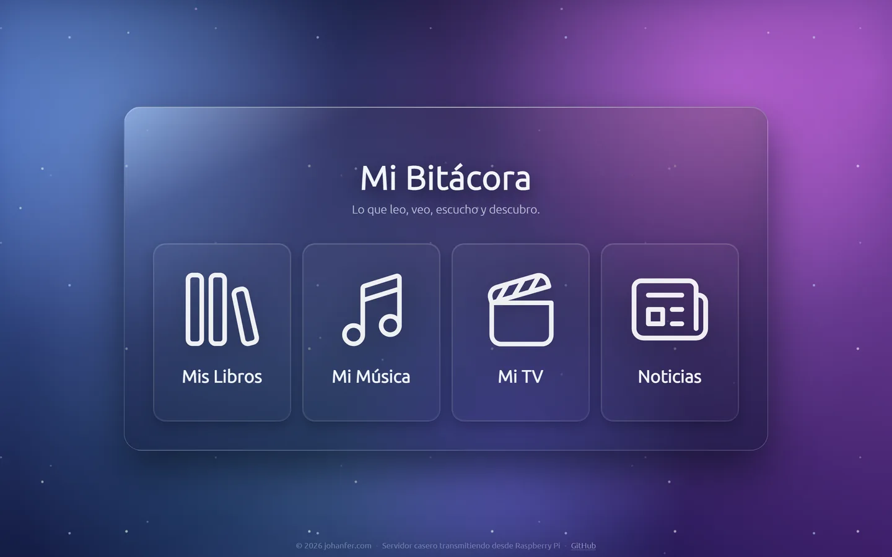
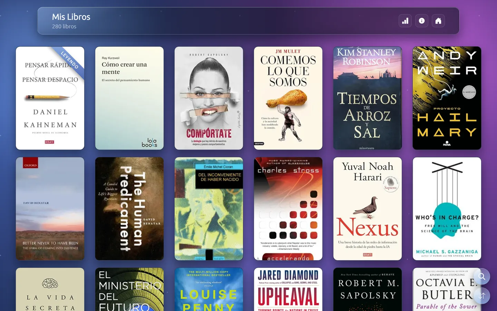
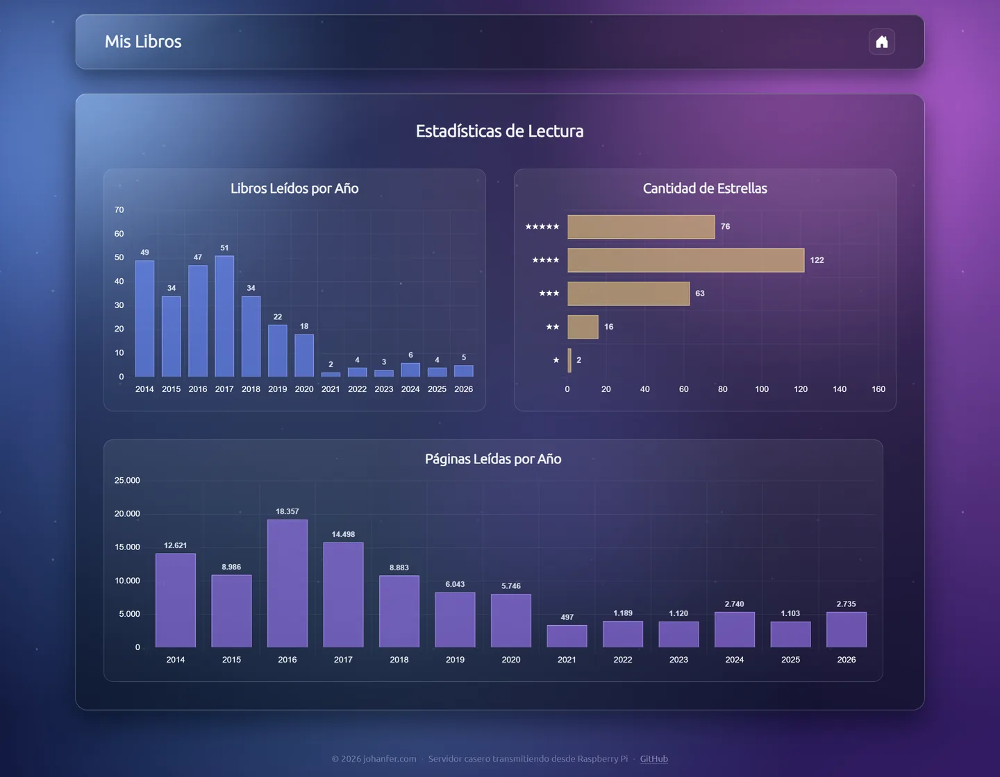
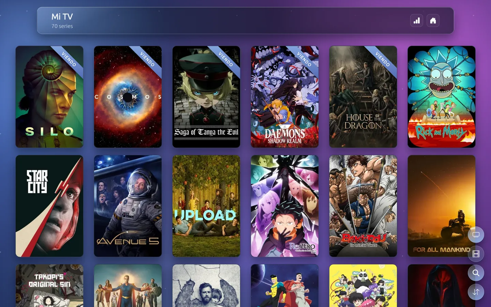
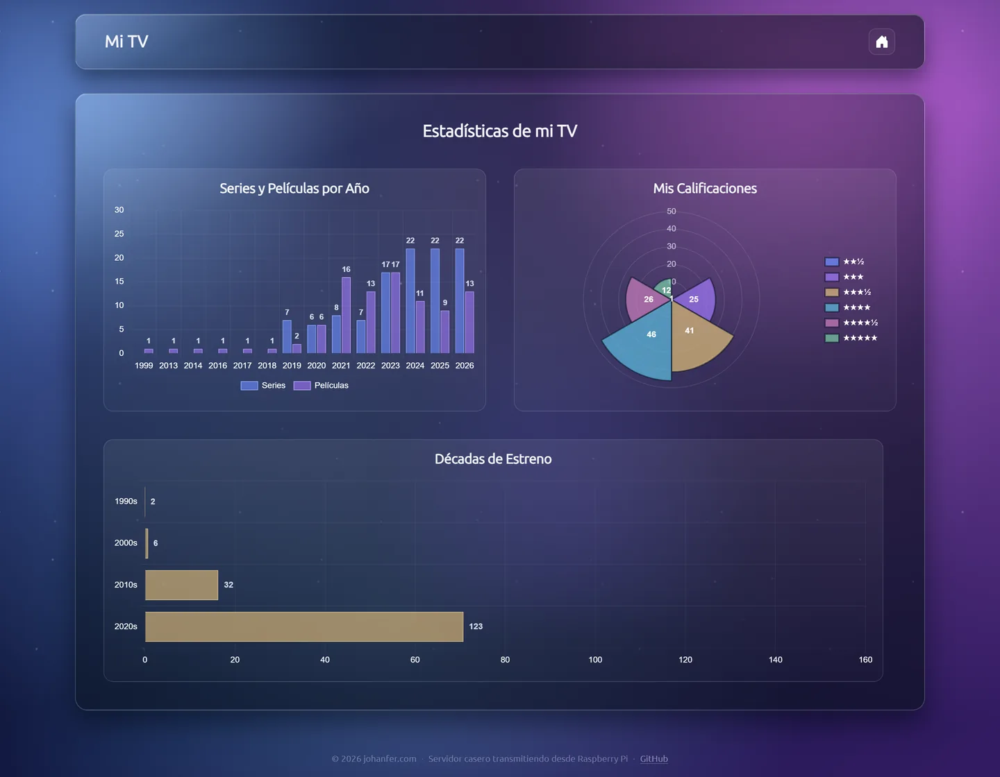
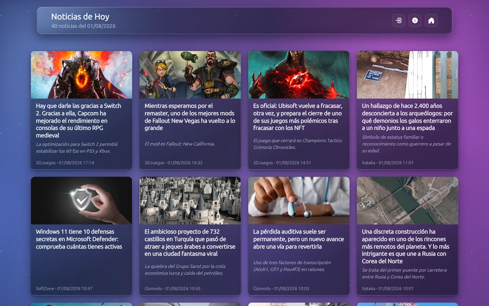
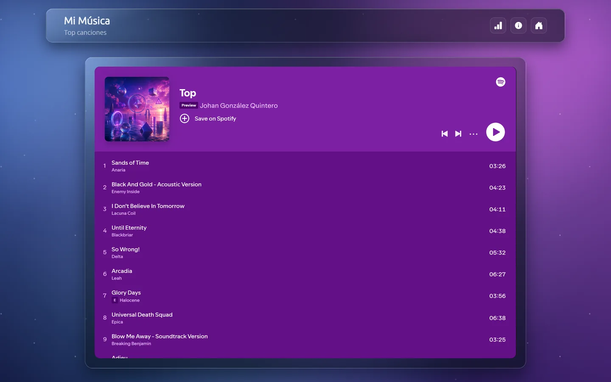
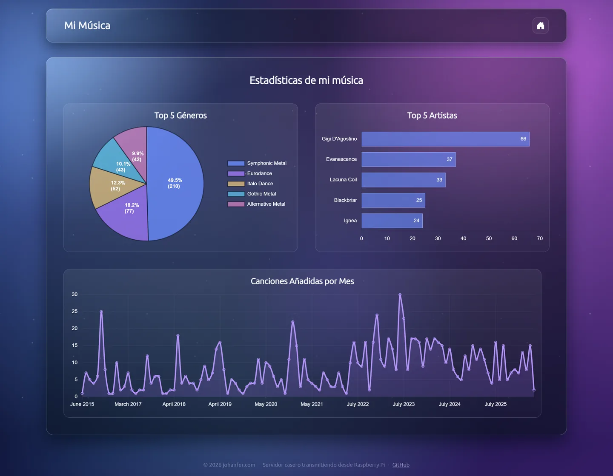

# Mi Bitácora: Libros, Series, Noticias y Música en Django

Este proyecto Django incluye cuatro aplicaciones principales: una biblioteca que se sincroniza con la lista de lectura de Goodreads vía RSS, una sección de series y películas que se sincroniza con el historial de Simkl, una aplicación de noticias que recopila artículos de fuentes RSS con procesamiento IA, y una aplicación que muestra datos archivados de Spotify.



> Las capturas de este README se tomaron de la instancia en producción ([johanfer.com](https://johanfer.com)), que corre en una Raspberry Pi casera.

## Aplicación de Libros

Esta aplicación sincroniza la lista de lectura de Goodreads a través de su feed RSS oficial y la almacena en una base de datos, incluyendo procesamiento de imágenes y seguimiento de cambios.



### Características

- Sincronización vía RSS de Goodreads:
  - Extrae datos completos: título, autor, portada, calificaciones, fecha de lectura, enlaces, descripción, ISBN, páginas y año de publicación.
  - Pagina el feed RSS automáticamente para cargas iniciales grandes.
  - Evita duplicados identificando los libros por su ID de Goodreads.
  - No requiere cookies de sesión ni scraping de HTML.
  - Lee también la estantería `currently-reading`: el libro en curso aparece primero en la biblioteca con un listón diagonal "Leyendo", sin calificación ni fecha hasta terminarlo.

- Procesamiento avanzado de imágenes:
  - Modifica los enlaces de portadas para obtener la máxima resolución disponible (700px).
  - Convierte automáticamente las imágenes JPG a formato WebP para optimizar almacenamiento y rendimiento.
  - Redimensiona las portadas a un tamaño óptimo (300x450) conservando la calidad.
  - Organiza las imágenes por ID en la carpeta `media/Covers`.

- Seguimiento de cambios:
  - Registra libros eliminados de la lista de lectura para análisis histórico.
  - Mantiene metadatos completos de los libros incluso después de eliminarlos.

### Estadísticas de lectura

La ruta `/bookshelf/stats/` (icono de gráfico en la cabecera) resume el histórico: libros leídos por año, reparto de calificaciones en estrellas y páginas leídas por año.



### Modelos principales

- **Book**: Almacena la información completa de cada libro (título, autor, portada, calificaciones, fecha, enlaces, descripción, flag de lectura en curso).
- **DeletedBook**: Registra libros que fueron eliminados de la lista de lectura en Goodreads.

## Aplicación de Series y Películas (watching)

Sección "Mi TV": sincroniza el historial de visualización desde la API de Simkl y muestra las series y películas vistas con sus pósters.

> La fuente fue Trakt hasta julio de 2026, cuando su API empezó a devolver 403 para perfiles públicos y pasó a exigir VIP. Desde agosto de 2026 los datos vienen de Simkl (API gratuita, token del flujo PIN que dura ~5 años y no necesita refresh). Los registros heredados de Trakt se conservan tal cual, con su `trakt_id` y su URL; lo que une ambas épocas es el `tmdb_id`.



### Características

- Sincronización con la API de Simkl:
  - Historial completo de películas y episodios, deduplicado por `tmdb_id` + temporada/episodio.
  - Consulta primero `/sync/activities`: si Simkl no reporta cambios, no descarga nada (la propia API advierte que golpear `/sync/all-items` en un timer puede costar la suspensión de la app).
  - La corrida diaria hace un pull completo para detectar además lo que se borró del otro lado.
  - Calificaciones personales y totales de episodios vistos por serie.
  - El anime se resuelve aparte: Simkl lo parte por temporada y lo numera en absoluto, así que se consulta su índice de episodios para traducirlo a la numeración real.
- Pósters y metadatos desde TMDB (calificación pública, episodios disponibles, sinopsis en español), convertidos a WebP en `media/Posters` (un póster por obra; los episodios comparten el de su serie).
- Una tarjeta por obra: los episodios de una serie se agrupan mostrando cuántos llevas y el último visto (ej. `T01E08`).
- Listón diagonal "Viendo" en series con actividad reciente que aún tienen episodios pendientes.
- Botones flotantes para alternar entre series y películas (`/viendo/?tipo=...`).

### Estadísticas de mi TV

La ruta `/viendo/stats/` compara series y películas por año, muestra el reparto de calificaciones propias (con medias estrellas) en un gráfico polar y agrupa lo visto por década de estreno.



### Modelos principales

- **WatchedItem**: Un evento del historial (película o episodio) con temporada/episodio, calificaciones, fecha, fuente (`simkl` o el histórico `trakt`) e IDs de Simkl/TMDB/IMDB.
- **SimklSyncState**: Guarda el sello de `/sync/activities` de la última sincronización, para no volver a descargar la biblioteca si nada cambió.

## Aplicación de Noticias (my_news)

Esta aplicación permite recopilar, filtrar y visualizar noticias de diferentes fuentes RSS con capacidades avanzadas de procesamiento mediante IA.



### Características

- Recopila noticias de múltiples fuentes RSS configurables con priorización automática de contenido reciente.
- Sistema de filtrado multicapa:
  - Filtrado automático basado en palabras clave personalizables.
  - Filtrado inteligente mediante instrucciones de IA configurables.
  - Detección de noticias redundantes mediante análisis de similitud vectorial (embeddings).
- Procesamiento con IA (Cerebras para resúmenes, Gemini para embeddings):
  - Generación de resúmenes concisos y objetivos de noticias.
  - Extracción de respuestas cortas para titulares tipo pregunta o clickbait.
  - Análisis automático de relevancia y calidad del contenido.
  - El modelo activo se configura en la BD (AIModelSetting, editable desde el admin) con nombre neutral de proveedor.
- Capacidad de extracción profunda de contenido:
  - Recuperación del texto completo de artículos cuando es necesario.
  - Extracción de imágenes de alta calidad de los artículos originales.
  - Limpieza y formateo automático del contenido HTML.
- Interfaz de usuario responsiva con:
  - Sistema de paginación para navegación eficiente.
  - Actualización en tiempo real del feed de noticias.
  - Notificaciones de nuevo contenido disponible.
- Optimización de rendimiento:
  - Sistema de reintentos inteligentes para APIs externas.
  - Procesamiento por lotes para mejorar velocidad.
  - Backoff exponencial para gestionar límites de API.

### Modelos principales

- **FeedSource**: Almacena información sobre las fuentes de noticias (nombre, URL, estado, umbral de similitud, configuración de búsqueda profunda).
- **News**: Contiene los detalles de cada noticia (título, descripción, enlace, fecha de publicación, imagen, embedding vectorial, puntuación de similitud, etc.).
- **FilterWord**: Define palabras clave para filtrado automático de noticias.
- **AIFilterInstruction**: Configura instrucciones personalizadas para el filtrado basado en IA.

## Aplicación de Música (spotify)

Esta aplicación muestra los datos musicales del usuario. La sincronización con la API de Spotify fue retirada (los cambios en la API la dejaron detrás de un plan de pago), por lo que los datos guardados son un archivo histórico que ya no se actualiza. La playlist actual se muestra mediante un iframe embebido de Spotify.



### Características

- Dashboard con la playlist actual embebida vía iframe oficial de Spotify (siempre al día, sin API).
- Estadísticas visuales sobre el histórico de favoritos guardado:
  - Top 5 géneros musicales con distribución porcentual.
  - Top 5 artistas con conteo de canciones.
  - Gráfico temporal de canciones añadidas por mes.
- Historial de canciones que fueron eliminadas de favoritos mientras la sincronización estuvo activa.

Las estadísticas viven en `/spotify/stats/`:



### Modelos principales

- **SpotifyFavorites**: Archivo histórico de las canciones favoritas con sus metadatos (ya no se actualiza).
- **DeletedSongs**: Historial de las canciones que fueron eliminadas de favoritos.

## Instalación

1. Clona el repositorio:

```
git clone https://github.com/tu-usuario/tu-repositorio.git
```

2. Configura Poetry para guardar los entornos fuera del repositorio e instala
   las dependencias:

```powershell
poetry config virtualenvs.in-project false
poetry config virtualenvs.path "$env:USERPROFILE\.virtualenvs"
poetry install
```

3. Aplica las migraciones de Django:

```
poetry run python manage.py migrate
```

4. Para actualizar los libros desde el RSS de Goodreads manualmente:

```
poetry run python manage.py shell -c "from home_page.utils import refresh_books_data; refresh_books_data()"
```

5. Para actualizar el feed de noticias manualmente:

```
poetry run python manage.py shell -c "from my_news.tasks import update_news_cron; update_news_cron()"
```

6. Instala los cronjobs en el servidor (necesario solo en producción):

```
python manage.py crontab add
```

## Variables de entorno recomendadas

Para abrir `/visitas/` sin iniciar sesión durante el desarrollo local:

```
DEBUG=true
VISITS_ALLOW_LOCAL_WITHOUT_LOGIN=true
```

La excepción solo se aplica cuando ambas variables están activas. En producción,
mantén `DEBUG=false`; los usuarios seguirán necesitando una cuenta de superusuario.

Para la sincronización de libros con Goodreads (vía RSS, sin cookies):

```
GOODREADS_RSS_URL=https://www.goodreads.com/review/list_rss/27786474?shelf=read
GOODREADS_RSS_PER_PAGE=200
```

Para la sección de series y películas (Simkl + TMDB):

```
SIMKL_CLIENT_ID=...     # Client ID de una app creada en https://simkl.com/settings/developer/
SIMKL_ACCESS_TOKEN=...  # Token del flujo PIN (ver abajo); dura ~5 años y no tiene refresh
TMDB_API_KEY=...        # API key gratuita de https://www.themoviedb.org/settings/api
```

El token se obtiene con un comando de gestión que imprime un PIN para escribir en
<https://simkl.com/pin>:

```
python manage.py simkl_auth
```

## Uso

### Tareas Automatizadas con django-crontab

El proyecto utiliza `django-crontab` para gestionar tareas programadas que actualizan automáticamente los datos. Estas tareas están definidas en los archivos `tasks.py` de cada aplicación y configuradas en `settings.py`:

```python
CRONJOBS = [
    # Libros: una vez al día a medianoche (RSS de Goodreads)
    ('0 0 * * *', 'home_page.tasks.update_books_cron'),

    # Series y películas: una vez al día a las 00:30 (API de Simkl)
    ('30 0 * * *', 'watching.tasks.update_watching_cron'),

    # Noticias: cada 30 minutos entre las 08:00 y las 21:30
    ('*/30 8-21 * * *', 'my_news.tasks.update_news_cron'),

    # Noticias: última pasada del día a las 22:00
    ('0 22 * * *', 'my_news.tasks.update_news_cron'),
]
```

#### Gestión de Tareas Programadas

- **Ver tareas programadas activas**:
  ```
  python manage.py crontab show
  ```

- **Añadir todas las tareas**:
  ```
  python manage.py crontab add
  ```

- **Eliminar todas las tareas**:
  ```
  python manage.py crontab remove
  ```

- **Reiniciar todas las tareas** (útil después de modificar la configuración):
  ```
  python manage.py crontab remove
  python manage.py crontab add
  ```

Las tareas se ejecutan automáticamente en segundo plano según su programación:

- **Libros**: Se actualizan una vez al día (00:00) leyendo el feed RSS de Goodreads.
- **Series y películas**: Se actualizan una vez al día (00:30) desde la API de Simkl.
- **Noticias**: Se actualizan cada 30 minutos dentro de la franja `08:00`–`22:00` (hora del servidor), para no trabajar de madrugada.

En ambientes de desarrollo local, puede ser más conveniente ejecutar estos comandos manualmente en lugar de configurar los cronjobs.

### Aplicación de Libros

1. Asegúrate de tener un entorno virtual activado y las dependencias instaladas.
2. La sincronización corre automáticamente por cron, o puedes lanzarla manualmente:
   `python manage.py shell -c "from home_page.utils import refresh_books_data; refresh_books_data()"`
3. Los datos se leen del feed RSS de Goodreads y se almacenan en la base de datos.
4. Las portadas de los libros se guardarán en la carpeta `media/Covers`.
5. En `/bookshelf/stats/` están los gráficos de lectura (libros por año, estrellas y páginas).

### Aplicación de Series y Películas

1. Crea una app en Simkl, obtén el token con `python manage.py simkl_auth` y configura las variables de entorno (ver arriba).
2. La sincronización corre automáticamente por cron, o puedes lanzarla manualmente:
   `python manage.py shell -c "from watching.tasks import update_watching_cron; update_watching_cron()"`
3. Accede a la ruta `/viendo/` para ver la sección "Mi TV"; los botones flotantes alternan entre series y películas.
4. Los pósters se guardan en la carpeta `media/Posters`.
5. En `/viendo/stats/` están los gráficos de series y películas (por año, calificaciones y décadas).

### Aplicación de Noticias

1. Configura tus fuentes de noticias RSS en el panel de administración.
2. Configura palabras de filtrado e instrucciones de IA según tus preferencias.
3. Accede a la ruta `/noticias/` en tu navegador para ver el feed de noticias.
4. Utiliza el botón de actualización para obtener las noticias más recientes.
5. Navega entre las páginas utilizando los controles de paginación.

### Aplicación de Spotify

La sincronización con la API de Spotify fue retirada; no requiere credenciales. Las vistas muestran el archivo histórico guardado en la base de datos y la playlist actual vía iframe.

1. Accede a la ruta `/spotify/` para ver el dashboard con la playlist embebida.
2. Visita `/spotify/stats/` para ver las estadísticas y gráficos del histórico de música.
3. Consulta `/spotify/deleted/` para ver el historial de canciones eliminadas.

Siéntete libre de personalizar y adaptar este proyecto según tus necesidades. Si tienes alguna pregunta o sugerencia, no dudes en abrir un issue en el repositorio.
